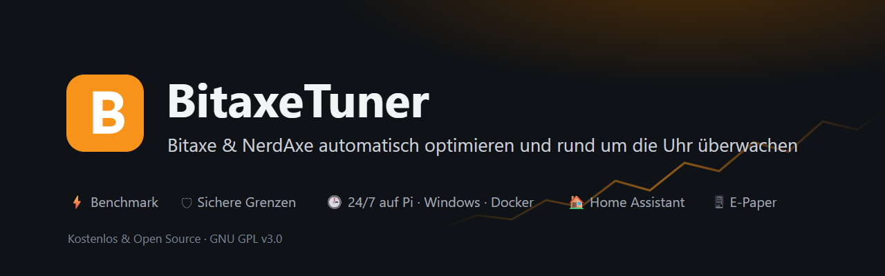

<p align="center"><a href="https://elemirus1996.github.io/BitaxeTuner/en/"></a></p>

<p align="center">
  <a href="https://github.com/Elemirus1996/BitaxeTuner/releases/latest"><b>⬇ Download</b></a> ·
  <a href="https://elemirus1996.github.io/BitaxeTuner/en/"><b>Website</b></a> ·
  <a href="https://elemirus1996.github.io/BitaxeTuner/en/pico-fans/">Pico build guide</a> ·
  <a href="#247-operation">24/7 server</a> ·
  <a href="README.md">Deutsch</a>
</p>

# BitaxeTuner

**Automatic overclocking, benchmarking and monitoring for Bitaxe and NerdAxe miners – as a Windows program (WPF)
and as a [24/7 server](#247-operation) for Raspberry Pi, Windows or Docker with a browser interface.**

BitaxeTuner raises your miner's frequency and core voltage step by step, measures every combination
(hashrate, power, efficiency, temperatures, error rate) and shows you the best setting at the end –
for **maximum hashrate**, **best efficiency (J/TH)** or a **balance** of both.
Several devices can be tested **in parallel**.

> ⚠️ **Overclocking at your own risk.** Higher frequency and voltage increase power draw and temperature
> and can damage the hardware. Check that your power supply and cooling are sufficient.

## Language

The desktop app, the browser interface, push notifications, the daily report, the e-paper display and Home Assistant
are available in **English and German**:

- **Desktop app**: *Settings → Language* (Automatic = Windows language). Takes effect after a restart of the app.
- **Browser**: the **EN/DE** button in the header – every browser keeps its own choice (default: browser language).
- **Server** (push, daily report, e-paper, status texts): *Settings → Server language* in the browser interface.
  A Raspberry Pi is set to English by default, so choose German there if you want German messages.
- Numbers and dates follow your system format as long as its language matches, otherwise the usual format of the
  language (English: en-GB, 24 h, DD/MM/YYYY).

Corrections to the English texts are welcome: they all live in
[`src/BitaxeTuner.Core/I18n/Strings.en.json`](src/BitaxeTuner.Core/I18n/Strings.en.json) (German original → English).

## Features

### Tuning

- **Automatic benchmark** per device:
  stable → raise frequency · unstable → raise voltage · limit reached → stop immediately.
  Optionally, the lowest stable voltage per frequency is searched as well (more efficient).
- **Safety watchdog** on every sample: max. chip temperature, VR temperature, power, input voltage, overheat and
  voltage errors reported by the firmware. On cancellation, error or program exit the original (or the best found)
  settings are restored.
- **Parallel operation** of several miners, **pause/resume** and resuming interrupted runs.
- **Live view** with hashrate/temperature history, **heatmap** frequency × voltage, results table, CSV export.
  Sort results by clicking a column (e.g. J/TH ascending) and **save them to the automation** directly (as a preset for
  schedule and electricity price – nothing changes on the miner).
- **Soak test** and **efficiency advisor** (see [Usage](#automation-soak-test-compare-phone-view)).
- **Simulation mode**: enter the address `sim` or `sim:<profile-id>` (e.g. `sim:nerdqaxe-plusplus`) –
  to try it out without real hardware (runs 30× faster).

### Monitoring

- **Overview and single view** with 14 tiles, wallet balance (mempool.space / Blockchair), history 1 h / 24 h /
  7 / 30 days from `history.db` (hashrate, temperature, power, efficiency J/TH).
- **Network**: recently found blocks, pool ranking, solo chances BTC/BCH.
- **Health early warning**: daily comparison of the last 7 days with the 4 weeks before – cooling (temperature per
  watt), efficiency without tuning change, fan speed, rejected shares, availability.
- **Watchdog** (restart at 0 hashrate), **firmware check**, **best diff records**, **tray**, autostart.
- **Tax** (German tax law, § 23 EStG): income with EUR price, sales/holding period (FIFO), CSV export, electricity
  cost per month next to the income.

### Power and costs

- **Electricity tariff** gross or net (with VAT rate); optionally **hourly prices** from aWATTar (exchange price +
  surcharge) or Tibber (final price).
- **Smart plugs** (Shelly Gen1, Plus/Pro/Gen3 with power metering): real consumption at the socket including power
  supply and extra fans, history against AxeOS, notice on failure or rising extra consumption. Read-only –
  **never switched**.
- **Monthly and annual report**: availability, avg hashrate/temperature/power, J/TH, kWh, electricity cost and
  income – as CSV or printable page (PDF), optional monthly push.

### Many miners

- **Automatic device discovery** (network scan in desktop and browser) and matching **device profiles** with sensible limits.
- **Copy settings**: take over one miner's pool/fallback and fan settings to others – preview old → new, backup of
  each miner first, worker names are kept, frequency and voltage are never copied.
- **Miner groups** (e.g. “Community”, “Basement”): filter and totals in the overview (browser), group filter in
  compare, push services for whole groups – new members get alerts and reports automatically.
- **Group automation** (from 0.9.7, browser → select a group → *Group automation*): one schedule or electricity price
  rule for the whole group; each miner uses its own preset of the same name (checked against its profile, missing →
  skipped). A miner's own rule takes precedence, thermal protection stays. Approval required – again whenever a miner
  joins the group. Plus *switch now* with a preview old → new per miner.
- **Soak test for several miners** at once, **compare** all miners side by side
  (including the current **pool difficulty** if the firmware reports it).
- **Comparison report** to print (browser *Compare → Report …*, desktop *Miner comparison → Report …*): 1–6 miners,
  period, values (current, average over the period, last benchmark) and charts of your choice; **cooling** preset
  (temperature per watt, VR, fan) for questions in the community. Without IP and wallet addresses.

### Tuning ↔ monitoring

- **One central poll** per miner (at most one request at a time) – monitoring and benchmark never poll twice.
- During a tuning change, a benchmark and the following restart the **watchdog pauses** for that miner, and there are
  **no offline alerts** for the intended restart.
- Every frequency/voltage change is logged with time, old and new value in `history.db` (table `tuning_events`),
  marked as a **line in all history charts** and compared in the **Before/after** tab (Ø 60 min before/after).
- Changes only after **confirmation** showing the current and the new value; values outside the profile limits are
  rejected. `overclockEnabled` is only set when the value is outside the AxeOS selection list – with a note in the dialog.
- **Theme**: dark or light.

### Miner logs, alerts, backups

- **Miner fan** (browser *Device → Live*, desktop *Set manually*): automatic with a target temperature (AxeOS
  `temptarget`, NerdQAxe `pidTargetTemp`; 45 °C up to the profile's chip limit) or a fixed value from 20 % – with an
  old → new confirmation and a log entry.
- **Log** (browser *Log*, desktop *Log …*): stored permanently in `history.db`, at least 30 days – every
  frequency/voltage change with its source (manual, benchmark, automation, restore …), benchmark start/abort, soak
  tests, automation/watchdog, fan control (VR and case), offline/online, settings and server events. Filter by period,
  miner, category and text, CSV export; continues after restarts and updates. Click an entry to see what it means and
  what you can do.
- **Help** (browser *Help*, desktop *Help*): short guide to the main workflows, every log entry with its meaning and
  “what to do”, the miner logs (AxeOS/ESP-Miner: structure of a line, pool, ASIC, temperature, voltage regulator,
  Wi-Fi, crash) and frequently asked questions – searchable, for every role.
- **Miner logs** per device live (`ws://<host>/api/ws`) and as a buffer (`/api/system/logs`), with text filter, levels,
  **categories** (shares, pool/stratum, ASIC/jobs, temperature/fan/power, system/Wi-Fi – with a count per type) and saving;
  same in desktop and browser.
- **Log alerts** (Settings → Log alerts, tick per miner): push on error lines and freely defined patterns
  (stratum disconnected, overheat, voltage errors, fallback …), cooldown per rule, silent during tuning/restart.
  The log tab and the alerts share one WebSocket connection; enabled alerts permanently use one slot on the miner.
- **Pool monitoring**: push when switching to the fallback pool, on a high reject rate within the time window and on
  slow pool responses; pool line in the monitoring view.
- **Back up/restore settings** (device header): complete backup under `snapshots\`, automatically before every
  benchmark and every manual change. Restore field by field with a preview old → new, profile limits are checked,
  frequency/voltage are logged. AxeOS does not hand out pool passwords, so they stay unchanged.

## Power, costs, reports and notifications

### Push notifications

*Settings → Push notifications* (desktop and browser). **Several services at once** are possible –
e.g. ntfy for you and Discord for a community group. For each service you choose **which notifications** (offline,
block found, daily report …) and **for which miners** (all or selected) it gets; “Test” checks each service on its own.
A previously configured service is taken over automatically as the first one.

| Service | What to enter |
|---|---|
| **ntfy** | server (default `https://ntfy.sh`) and a hard-to-guess topic; “ntfy” app on the phone |
| **Telegram** | bot token (from @BotFather) and chat ID |
| **Discord** | webhook URL of a channel (*channel settings → Integrations → Webhooks*) |
| **Pushover** | user key and app token (pushover.net) |
| **Custom webhook** | URL; BitaxeTuner sends `POST` with JSON `{"source":"BitaxeTuner","title":…,"message":…,"priority":"high","priorityLevel":4,"time":…}` – e.g. to Home Assistant or n8n |

Notification types per service: offline, overheating, block found/income, watchdog/automation/firmware,
records, log alerts, pool, smart plugs, health. Plus the **daily report** (avg hashrate, J/TH, temperature,
availability per miner, electricity cost, best diff record, tuning changes, worthwhile advisor suggestions) and the
**monthly report** on the 1st. Every notification has a cooldown so a flapping miner does not flood your phone.

**Daily and monthly report per service:** if a push service has a miner selection (e.g. a community group), the reports
contain only these miners – totals and costs only for them, never income from the tax section. Per service you can also
leave out electricity cost, income, advisor recommendations, best diff record, tuning changes and smart plug details.

### Electricity cost

*Settings → Power and polling / Electricity price* (desktop) or *Settings → General / Electricity price source* (browser):

- **Electricity price** (ct/kWh) of your contract, either **gross (incl. VAT)** or **net (excl. VAT)** with VAT rate
  (default 19 %). Calculations always use the gross price.
- **Calculate electricity costs with hourly prices** (optional): cost hour by hour from energy × price of that hour.
  aWATTar provides the exchange price **net, without grid fees and taxes** – enter the **surcharge** for that
  (typically 15–25 ct/kWh); VAT is added automatically. Tibber provides the final price, surcharge 0. Hours without a
  price use the fixed electricity price.
- With **smart plugs**, the consumption at the socket counts instead of the AxeOS power (can be switched off).

### Smart plugs (Shelly)

*Settings → Smart plugs* (desktop and browser; in the desktop app *Smart plugs …* also jumps there):

1. **Add plug**, enter the IP address (or name) – home-network addresses only. Channel 0 for sockets.
   Protected Shellys: user (Gen2+ always `admin`) and password; the password is kept in `secrets.json`.
2. **Test** shows model, generation and current power – even before saving.
3. Choose the **role**:
   - *powers miners* – the ticked miners are behind this plug; with several, it is split by AxeOS share,
   - *other consumers* – extra fans, Pi, router … (added to the costs),
   - *total measurement* – everything is behind it; replaces the sum (at most one plug).
4. **Save**. The overview shows “Power (socket)”, the PSU/other share and each plug's value; clicking a plug opens
   the history socket vs. AxeOS.

Supported: Shelly Gen1 (`/status`, e.g. Plug S) and Gen2+/Gen3 (RPC `Shelly.GetStatus`, e.g. Plus Plug S, PM Mini,
Pro EM-50). Push when a plug has not responded for 5 min or the extra consumption rises clearly compared with the
previous week (e.g. an ageing power supply). Home Assistant gets power and energy per plug (energy dashboard).
**BitaxeTuner never switches the plugs** – not even when the server itself is behind a plug.

### Reports

Browser *Reports* or desktop *Report …*: choose a month or year. Per miner availability, avg hashrate, temperature,
power, J/TH, kWh and tuning changes; plus smart plug energy, electricity cost (with hourly prices if set up) and
income from the tax section. **View / print** opens a printable page (in the browser “Save as PDF”), **CSV** for
Excel. Completed months are stored in `history.db` – annual reports work even after older per-minute values have been
cleaned up. The **tax section** shows the electricity cost per month next to the income (not tax advice).

### Health early warning

Once a day BitaxeTuner compares the last 7 days of each miner with the 4 weeks before and reports only clear changes
(each notice at most once a week):

| Notice | Condition |
|---|---|
| Check cooling | temperature per watt +10 % and at least +3 °C |
| Efficiency declining | J/TH +5 % without tuning change in the compared period |
| Fan losing speed | speed per % of control −15 % |
| More rejected shares | at least +1 percentage point and twice as many |
| Offline more often | below 97 % instead of 99 % or more before |

The values are shown in the browser per miner in the **Health** tab and in the desktop app in the single view. Fan and
rejected shares are recorded since 0.7.0 – the comparison needs a few weeks of data.

## Supported devices

| Device | ASIC | Board / deviceModel | Firmware |
|---|---|---|---|
| Bitaxe Max | BM1397 | 2.2, 102 | AxeOS |
| Bitaxe Ultra | BM1366 | 0.11, 201–205, 207 | AxeOS |
| Bitaxe Supra | BM1368 | 400–403 | AxeOS |
| Bitaxe Gamma | BM1370 | 600–603 | AxeOS |
| Bitaxe Gamma Duo | 2× BM1370 | 650 | AxeOS |
| Bitaxe GT / Gamma Turbo | 2× BM1370 | 801 | AxeOS |
| Bitaxe Gamma Hex | 6× BM1370 | 1300 | AxeOS (limits preliminary) |
| Bitaxe Naja Duo | 2× BM1373 | 1201 | AxeOS (limits preliminary) |
| Bitaxe Hex / SupraHex | 6× BM1366 / BM1368 | 302–303 / 701–702 | AxeOS |
| NerdAxe / NerdAxe Gamma | BM1366 / BM1370 | NerdAxe / NerdAxeGamma | NerdQAxe firmware |
| NerdAxe Gaia | BM1373 | NerdAxeGaia | NerdQAxe firmware ≥ 1.1.0 |
| NerdQAxe+ / NerdQAxe++ | 4× BM1368 / BM1370 | NerdQAxe+ / NerdQAxe++ | NerdQAxe firmware |
| NerdHaxe-γ | 6× BM1370 | NerdHaxe-γ | NerdQAxe firmware |
| NerdOctaxe-γ / NerdOctaxe+ | 8× BM1370 / BM1368 | NerdOCTAXE-γ / NerdOCTAXE+ | NerdQAxe firmware |
| NerdEKO | 12× BM1370 | NerdEKO | NerdQAxe firmware |
| NerdQX | BM1370 | NerdQX | NerdQAxe firmware |
| Q1370 / Q1373 | 4× BM1370 / 4× BM1373 | Q1370 / Q1373 | NerdQAxe firmware (limits preliminary) |

Values according to ESP-Miner `main/device_config.h` and NerdQAxePlus `main/boards/*.cpp` (as of 09/2026); the source
of each profile is in its note. If the device reports its chip count or small cores itself, those values take precedence.
Unknown devices with an AxeOS-compatible API run with a conservative generic profile.
All profiles can be adjusted or extended via **“Edit profiles”** (`profiles.json` in the data folder).

## Installation

On first start, **“First steps”** guides you through the essentials (miners, electricity price, push service, backup
or 24/7 server) – each step ticks itself off and jumps to the right setting. After an update, BitaxeTuner asks once
whether you want a short **introduction to just the new features**.

1. Download `BitaxeTuner-Setup-x.y.z.exe` from [Releases](https://github.com/Elemirus1996/BitaxeTuner/releases).
2. Run the setup – the target folder is up to you, no admin rights needed.
3. Alternatively: unpack `BitaxeTuner-x.y.z-portable-win-x64.zip` and start `BitaxeTuner.exe`.

**No** separate .NET installation is required.

## 24/7 operation

The miners keep running without a PC – but history, push notifications, watchdog, automation rules, soak tests,
benchmarks, the daily report and tax recording only happen while BitaxeTuner is running. To have all of that around the
clock without keeping your PC on, install the **BitaxeTuner server** on a device that is running anyway:

| Device | Package | Effort |
|---|---|---|
| Raspberry Pi 3/4/5, Zero 2 W – **ready-made SD image** | `BitaxeTuner-Server-x.y.z-pi-arm64.img.xz` | Raspberry Pi Imager |
| Raspberry Pi 3/4/5 (Pi OS 64-bit) | `BitaxeTuner-Server-x.y.z-linux-arm64.tar.gz` | 2 commands |
| Raspberry Pi with a 32-bit system | `…-linux-arm.tar.gz` | 2 commands |
| Linux PC / mini PC (x64) | `…-linux-x64.tar.gz` | 2 commands |
| Second Windows PC / mini PC | `BitaxeTuner-Server-Setup-x.y.z.exe` (Windows service) | Setup |
| NAS / home server with Docker | `ghcr.io/elemirus1996/bitaxetuner-server` | `docker compose up -d` |

The server needs little: about 100–150 MB RAM, hardly any CPU; a Pi 3B+ is enough. history.db writes at most one
record per minute and miner (easy on the SD card).

**Raspberry Pi – ready-made image (easiest)**

1. Write `…-pi-arm64.img.xz` with **Raspberry Pi Imager** (“Use custom”). The image is based on Raspberry Pi OS Lite
   (64-bit) and contains the pre-installed server (not an official Raspberry Pi product). The Imager offers no settings
   for custom images – the desktop app enters user, Wi-Fi and SSH (step 2).
2. Re-insert the SD card; in the desktop app choose *Mode … → Prepare Raspberry Pi*: select the “bootfs” drive,
   set the admin password, enter user/password for the Pi and Wi-Fi, optionally *Include my data*.
   Country, time zone and keyboard are taken from Windows (editable); optionally store an *SSH key* for password-less
   login. Afterwards **“SSH terminal”** at the top of the app opens a console on the server; for a Pi or Linux server
   that is already running, once *Mode … → SSH terminal to server → Transfer key …*.
   The app writes the cloud-init files (`user-data`, `network-config`, `ssh`) and a setup package to the card
   (all passwords only as hashes) and remembers address and token.
3. Insert the card into the Pi and power it on (first boot 3–5 minutes). The Pi applies the package, deletes it from the
   card and starts **paused**. In the app: *Test connection* → *Switch only* – only then does the Pi poll the miners.

Build it yourself: `sudo deploy/pi-image/build-image.sh BitaxeTuner-Server-x.y.z-linux-arm64.tar.gz` (Linux/WSL;
downloads the official image and checks its SHA-256). First-boot log on the Pi: `/var/log/bitaxetuner-firstboot.log`.

**Raspberry Pi / Linux (package)**

```sh
tar xzf BitaxeTuner-Server-x.y.z-linux-arm64.tar.gz
cd bitaxetuner-server && sudo ./install.sh
```

`install.sh` creates a system user, installs to `/opt/bitaxetuner`, data to `/var/lib/bitaxetuner` and sets up the
systemd service `bitaxetuner` (autostart, restart on crash). At the end it shows the address and the **setup code**.
Log: `journalctl -u bitaxetuner -f`. Remove: `sudo ./install.sh --uninstall` (data is kept) or `--purge`.
Own settings (port, HTTPS) in `/etc/default/bitaxetuner`, e.g. `BITAXETUNER_PORT=8484`.

**Windows (second PC)**: run `BitaxeTuner-Server-Setup-x.y.z.exe`. It sets up the service “BitaxeTuner”
(autostart, restart on failure) and a firewall rule **for private networks only**. Data: `C:\ProgramData\BitaxeTuner`,
setup code in `SETUP-CODE.txt` there. The folder is readable only by SYSTEM and
administrators (credentials), so open the code e.g. with Notepad “Run as administrator”.

**Docker**: download [`deploy/docker/docker-compose.yml`](deploy/docker/docker-compose.yml), run `docker compose up -d`,
get the setup code with `docker compose logs bitaxetuner`. Data in the volume `/data`.

**Setup**: open `https://<IP>:8484/` in the browser (from 0.9.4 new installations start encrypted; confirm the warning
about the self-signed certificate once), enter the setup code and set an admin password.
Then add devices, push service etc. under *Settings* – or transfer the data from your PC (see below).

### Extra fans, e-paper display and buttons (Raspberry Pi Pico)

A Raspberry Pi Pico (2) on the server's USB controls up to six 4-pin PWM fans (5 V or 12 V): one VR fan per miner
(manual or automatic by VR temperature) and one case group (by VR, ASIC or temperature sensors). Several DS18B20
(e.g. power supply, miner room) are detected automatically and each gets a name and its own warning threshold.
Optionally a 7.5" e-paper (red/black/white) shows the most important values, plus four buttons:
*next screen/acknowledge* · *fans automatic* · *100 %* (hold 5 s: *fans off*) · *restart Pi + Pico* (hold 3 s).
The server flashes the Pico program itself. Safety: miner offline or data older than 30 s → 100 %; Pico without a
command for 5 s → 100 %; without the Pico every fan runs at full speed via the circuit.
The e-paper rotates pages (overview, daily summary – optionally with graph –, history 24 h, soak test, pool & network;
from 0.9.7 also per miner group, monthly summary with a bar per day, BTC/BCH price with difficulty countdown, electricity
price traffic light, temperature sensors and a QR code to the web UI; colours optionally inverted) and shows special screens
full-screen: **block found** (selectable: until button 1 or after a configurable number of hours, or like warnings only with button 1), **warnings** (until acknowledged, a new warning shows again),
**best diff record** (once) – each can be switched on or off. Settings and a preview of each page:
browser → *Fans & display*. Wiring diagram, solder-free breadboard build and shopping list are in the build guide
[docs/en/pico-fans](https://elemirus1996.github.io/BitaxeTuner/en/pico-fans/).
No soldering and no breadboard: the ready-to-assemble **fan board** for the Pico 2 H with order files for JLCPCB is in
[`hardware/lueftersteuerung-v1`](hardware/lueftersteuerung-v1/) (prototype v1.0, measure before continuous use; German readme).

**No cable to the server (from 0.9.7):** with a Pico 2 WH, fan control and display run over WLAN – as fan Pico on the
board and/or as display Pico simply plugged onto the Waveshare e-paper. Prepare it once via USB on the server under
*Fans & display → “… set up for WLAN”*, then connect it to its own power supply. Every line is signed with its own key,
the WLAN password stays on the Pico only, the fail-safe (100 %) remains. Guide:
[Pico via WLAN](https://elemirus1996.github.io/BitaxeTuner/en/pico-fans/#wlan).

### Prometheus / Grafana

*Settings → Prometheus / Grafana* (browser): enable the export and create a token (shown only once). The server then
serves hashrate, expected hashrate, power, efficiency, chip and VR temperature, frequency, voltage, fan, shares, best
diff and uptime per miner at `/metrics`, plus totals, electricity price, cost per day, smart plugs, extra fans and
temperature sensors – **without IP and wallet addresses**. Put the token into `prometheus.yml` as `bearer_token` (an
example is shown in the interface). Off by default; nothing is served without a valid token.

### Home Assistant / MQTT

*Settings → Home Assistant / MQTT* (browser): broker address (e.g. Home Assistant's Mosquitto add-on), user, password.
BitaxeTuner sends hashrate, power, efficiency, temperatures, frequency/voltage (read-only), best diff, soak test,
extra fans, temperature sensors and smart plugs (power, energy for the energy dashboard, total power at the socket);
Home Assistant creates a device per miner and one for the server automatically
(MQTT discovery, availability via last will). Controllable from Home Assistant: “Refresh display” and – only if
allowed – the extra fan mode (automatic / 100 % / off). **Frequency and voltage cannot be changed via MQTT.**
The password is kept separately in `secrets.json` and never goes into backups or transfers.

### Backup

Once a day (default from 3 am) BitaxeTuner backs up settings, history (history.db), tax data, benchmark results and
miner backups as a verified archive (SHA-256 per file, integrity_check, fully unpacked and checked once before
storing). Targets under *Settings → Backup* (browser):

- **Data folder** (`auto-backups`, always; default: the last 7),
- **Folder or USB stick** – on the Pi, an inserted stick (FAT32, exFAT, ext4) is mounted automatically at
  `/media/bitaxetuner-usb`; on a Pi that is already set up, run `sudo sh /opt/bitaxetuner/current/install.sh --system` once,
- **Network drive/NAS** (SMB, without mounting it in the system; password kept separately in `secrets.json`, never in backups),
- **PC fetches**: the desktop app in “Server” mode fetches a verified backup to a folder on the PC every day (default
  `Documents\BitaxeTuner-Sicherungen`). It asks once after the first connection; later at the top under
  **Backups ▾** (fetch now, open folder) or *Mode …*.

Old backups are cleaned up per target (only our own files). Errors arrive as push notifications.

**Before every server update** a verified backup is created automatically on all configured targets (data folder,
USB stick, NAS); if it fails, nothing is installed. With “Download the backup to this PC first” (default: on) the browser
also downloads it – in the desktop app straight into the app's backup folder.

The **desktop app in local mode** backs up daily to its data folder (`auto-backups`) in the same way; under
*Settings → Backup* you can add a second folder (USB stick, second drive or NAS share such as
`\\nas\backup\BitaxeTuner`), plus “Back up now” and “Open backup folder”.

#### Restoring a backup

Every backup is fully unpacked and verified before it is restored; a damaged file is rejected without changing
anything. The previous state is kept as a `backup-<date>` folder in the data folder – so a restore can be undone.
Restored are settings, devices, history, tax data, benchmark results and miner backups. **Not** changed: admin
password and API tokens (the desktop app stays connected), backup targets, MQTT, stored passwords and the miners
themselves (restore their settings per device under *Backups* if needed).

| Situation | How |
|---|---|
| Server running, older state wanted | Browser → *Settings → Backup* → **Restore …** next to the backup |
| SD card/server broken | Set up again (Pi image or installer), set the admin password, then *Settings → Backup → Upload and restore …* with the file from USB stick, NAS or PC (`Documents\BitaxeTuner-Sicherungen`) – or in the desktop app **Backups ▾ → Restore a backup to the server …** |
| Desktop app without server | *Settings → Backup → Restore backup …*; the app restarts and restores the backup while doing so |

Backup files are named `bitaxetuner-backup-YYYYMMDD-HHMMSS.zip` and can be used with both the desktop app and the server.

### Desktop app or server – what works where?

| | Desktop app (local) | Server (browser, phone) | Desktop app with server |
|---|:---:|:---:|:---:|
| Runs around the clock without the PC switched on | – | ✓ | ✓ (the server) |
| Operation | Windows window | browser on PC, phone, tablet | Windows window showing the server interface |
| Monitoring, history, push, daily report | ✓ | ✓ | ✓ |
| Benchmark, soak test, automation, watchdog | ✓ | ✓ | ✓ |
| Miner search, copy settings | ✓ | ✓ | ✓ |
| Smart plugs, electricity cost, monthly/annual report | ✓ | ✓ | ✓ |
| Health early warning | ✓ (push, single view) | ✓ (push, *Health* tab) | ✓ |
| Compare with filters, before/after, efficiency advisor | compare | ✓ | ✓ |
| Home Assistant / MQTT | – | ✓ | ✓ |
| Prometheus / Grafana (`/metrics`) | – | ✓ | ✓ |
| Pico fans, e-paper, buttons | – | ✓ | ✓ |
| Tax: record incoming payments | ✓ (while the PC runs) | ✓ around the clock | ✓ |
| Tax: edit wallets and sales | ✓ | ✓ in the browser (from 0.9.6) | ✓ in the browser (from 0.9.6) |
| Backup | daily, second folder/USB/NAS | daily, USB stick, NAS | plus a daily copy on the PC |
| Phone access | view only (PIN) | full (admin) or view only (PIN) | as server |
| Prepare Raspberry Pi, SSH terminal | ✓ | – | ✓ |

You can switch in both directions at any time with all your data (see *Switching and switching back*).

### Browser or desktop app

- **Browser** (PC, phone, tablet): overview, compare, per miner live values and history with tuning markers,
  benchmark, results, before/after, health, automation rules with approval, soak test, backups, live miner logs,
  smart plugs with history, reports, tax (income, electricity cost per month, CSV), settings. Light/dark, phone-friendly, can be added to the home screen as an app.
  Frequency/voltage change – just like on the desktop – only after a dialog with old and new value and the profile limits.
- **Roles**: *Admin* (password, everything) and *View only* (PIN, without IP and wallet addresses, without logs).
- **View accesses** (Settings → View accesses): a separate PIN per person (at least 6 digits, stored only as a hash),
  optionally limited to certain miner groups – then without other miners, totals, history and e-paper across all
  miners. Revocable one by one (open sessions end immediately); sign-ins, creation and revocation are logged.
- **Kiosk / wall tablet** (from 0.9.8, Settings → *Kiosk / wall tablet*): full screen without menu – totals, warnings,
  one tile per miner, keeps the screen on (HTTPS). Sign-in as the admin prefers: a **kiosk link** (open once on the
  tablet, signs in by itself even after server restarts, can be limited to groups, revocable) or a **view PIN** and then
  open `…/#/kiosk`. Without server: the desktop app's phone view with `?kiosk=1`.
  **Kiosk designer:** several designs with colour templates or own colours, font size, animations (values count up,
  warnings pulse, fade-in, moving background, glow) and freely arranged panels (title, clock, key figures, warnings,
  miners, history, fans, sensors, custom text) via drag and drop – each kiosk link can have its own design.
- **Desktop app** in “Server” mode: *Mode …* → server address (or *Search network*) and an **API token**
  (server interface → Settings → *Connect desktop app*), then *Test connection*. The app then shows the server's
  interface and polls **no** miners itself. The token can be revoked at any time.

### Switching and switching back (data transfer)

*Mode …* in the desktop app:

- **Local → Server**: *Transfer data and switch* sends `config.json`, `history.db`, tax data, benchmark results and
  backups to the server once. Everything is verified (SHA-256 per file, `integrity_check`, row counts). If the server
  already has data, the app asks and the server backs up its state first (`backup-…`). Your local data stays unchanged.
- **Server → Local**: *Fetch data from the server and switch* pauses the server, downloads its state, verifies it,
  backs up the local state and takes it over when the app restarts.
- **Never twice**: only one side ever polls the miners. If the app starts in “Local” mode while a known server polls
  the same miners, it asks (switch, or pause the server). A paused server shows this in its interface and can be
  resumed there.

### Security

- Reachable only from private networks (home network, Docker network, VPN such as **Tailscale**/WireGuard).
  Do **not** forward the port in your router – use a VPN when you're away.
- Admin password as a PBKDF2 hash, lockout after 5 failed attempts, session cookies HttpOnly/SameSite=Strict,
  CSRF protection for all changes, API tokens stored only as hashes.
- HTTPS with a self-signed certificate: **new installations (from 0.9.4) start encrypted**. Existing servers stay on
  HTTP and show the admin a hint “Switch to HTTPS” (overview or *Settings → Connection*, in the desktop app a button in
  the server window); the server restarts. The desktop app takes over address and fingerprint itself when switching,
  otherwise it asks you to confirm the fingerprint when connecting for the first time. It can still be fixed with
  `BITAXETUNER_HTTPS=1` or `=0`.

### Updates

- Server: *Settings → Server update*. Raspberry Pi/Linux: the new version is placed next to the old one and switched
  atomically (the old one stays as a fallback in `/opt/bitaxetuner/versions`). Windows: silent setup, the service restarts.
  Docker: `docker compose pull && docker compose up -d`. Every file is checked against the published SHA-256 checksum;
  from 0.9.4 the checksum list must also be signed with the project's release key (`SHA256SUMS.txt.sig`), otherwise
  neither the desktop app nor the server installs anything.
- Desktop app and server check each other's versions when connecting; if they don't match, you get a clear message.

## Usage

1. Enter the miner's IP address on the left (or **“Scan network”**).
2. Check the profile (detected automatically) and adjust range, measuring time and limits in the **Benchmark** tab.
3. **Start benchmark**. Default: 90 s warm-up + 10 min measurement per combination.
4. In the **Results** tab choose the ranking and apply the best setting.

**Desktop app in “Server” mode:** one button at the top (“Update vX: server + app”) updates both in turn – verified
backup to the PC, server update (the server also backs up to USB/NAS), waiting for the restart with the new version,
then the app. If a step fails, nothing further is done.

### Automation, soak test, compare, phone view

- **Presets** per miner (e.g. “Hashrate”, “Efficiency” – also directly from the last benchmark).
- **Temperature protection**: on a sustained limit violation, lower the frequency step by step (voltage stays),
  never below a minimum, optionally step back up when the miner is cool again.
- **Schedule or electricity price**: preset by weekday/time or by price threshold.
  Price sources: aWATTar DE/AT (exchange price, no account) or Tibber (final price, API token).
- Automation rules act **only after explicit approval** per rule; any change to the rule revokes the approval.
  At least 10 min between two automatic changes, paused during benchmark/soak test/maintenance.
  Every change: source “Automation” in history.db, marker in the history, push.
- **Soak test** (6–48 h) of the current setting: hashrate share, error rate, temperatures, reachability; survives app
  restarts. On failure, a suggestion of the next lower stable setting (applied only after confirmation).
  **For several miners at once**: overview (browser) or *Soak test …* (desktop) – selection, one duration,
  one confirmation with the current setting per miner; “Cancel all”.
- **Efficiency advisor** (browser → *Compare* → *Recommendations*): per miner the best tested setting for efficiency,
  balanced or hashrate – from stable benchmark results within the profile limits; passed soak tests count more,
  failed ones are never suggested. Shows the change in hashrate, power and power cost per month;
  “Apply …” or “Apply + 24 h soak test …” only through the confirmation dialog (old → new).
  Worthwhile suggestions (from 1 €/month) also appear in the daily report.
- **Compare**: all miners side by side – current setting, 24 h average, availability, best benchmark results,
  highest stable frequency (chip quality).
- **Phone view** (Settings → Phone view): read-only web page on the home network, sign-in with PIN, private address
  ranges only, lockout after failed attempts, no wallet addresses. Windows asks for firewall permission on first
  start – allow “Private networks” only.

### Data

All data lives in **one** folder, default `%AppData%\BitaxeMonitor\` (the former BitaxeMonitor folder):
`config.json` (devices and all settings), `history.db` (history, tuning events, soak tests, smart plug values,
electricity prices, monthly reports, health data), `tax\*.json`, `tuning\results\*.json`, `tuning\profiles.json` and
`secrets.json` (passwords for NAS, MQTT and smart plugs – encrypted on Windows, readable only by the service on Linux,
never in backups or transfers). Tokens and API keys (push services, Tibber, Blockchair, CoinGecko, the desktop app's
server token) are kept there too; `config.json` only holds a reference. Backups therefore don't contain them – after
restoring on another computer, enter them once again. Transfers (desktop ↔ server, Pi setup) take the tokens along.

- On first start the folder is backed up completely to `backup-<date>\` (history.db via the SQLite backup API).
- Devices and results of the former standalone BitaxeTuner (`%LocalAppData%\BitaxeTuner`) are **copied** once –
  never moved, never overwritten.
- **Settings → Data folder → Move …**: copies everything, verifies it (integrity_check, row counts, SHA-256) and only
  then switches over; the old folder is kept. Nothing is overwritten in the target.
- Crash log: `crash.log` in the data folder.

If the old BitaxeMonitor is still running, the program warns at startup (otherwise double polling and writes).

## How is it measured?

- API: `GET /api/system/info`, `GET /api/system/asic`, `PATCH /api/system` (`frequency`, `coreVoltage`),
  `POST /api/system/restart` – see [ESP-Miner](https://github.com/bitaxeorg/ESP-Miner) and
  [ESP-Miner-NerdQAxePlus](https://github.com/shufps/ESP-Miner-NerdQAxePlus).
- For each combination the trimmed mean of the hashrate is calculated (outliers discarded) and compared with the
  theoretical hashrate (`expectedHashrate` or frequency × small cores × chips).
  Stable = at least 94 % of the target hashrate and an error rate below the limit.
- The approach is based on [mrv777/Bitaxe-Hashrate-Benchmark](https://github.com/mrv777/Bitaxe-Hashrate-Benchmark).

## Build it yourself

Requirements: .NET 8 SDK, optionally [Inno Setup 6](https://jrsoftware.org/isinfo.php) (installed via winget by `build.ps1` if needed).

```powershell
dotnet test                 # tests
dotnet run --project src/BitaxeTuner.App
.\build.ps1                 # tests + desktop (exe, ZIP, setup) + server (Linux packages, Windows setup) in .\artifacts
dotnet run --project src/BitaxeTuner.Server -- --data .\serverdata --port 8484
docker build -f deploy/docker/Dockerfile -t bitaxetuner-server .
```

A release is created automatically by GitHub Actions as soon as a tag `v*` is pushed.

## Project structure

```
src/BitaxeTuner.Core     API client, device profiles, benchmark engine, simulator, storage, I18n (texts DE/EN),
                         Host/MinerHub (the engine: polling, history, alerts, watchdog, automation, benchmarks),
                         Transfer (data transfer, server client)
src/BitaxeTuner.App      WPF interface (MVVM) – mode “Local” (engine in-process) or “Server”
src/BitaxeTuner.Server   ASP.NET Core service: engine + REST API /api/v1 + live events + browser interface (wwwroot)
deploy/                  install.sh + systemd unit (Linux/Pi), Dockerfile + docker-compose.yml
tests/                   xUnit tests (engine, hub, server API, data transfer, translations)
installer/               Inno Setup scripts (desktop, server service)
```

## Notes / disclaimer

- **No warranty.** BitaxeTuner is provided without any warranty (GPL-3.0, sections 15–16). Overclocking, higher
  voltages and your own fan circuits are at your own risk.
- **Independent project.** BitaxeTuner is not affiliated with, endorsed or reviewed by the Bitaxe project (bitaxe.org),
  NerdAxe, Raspberry Pi Ltd, Home Assistant, Waveshare, Shelly, Tibber, aWATTar, Discord, Pushover or Telegram. All names and trademarks belong to their respective owners
  and are only used to describe compatibility.
- The ready-made Pi image is based on Raspberry Pi OS and is **not an official Raspberry Pi product**; licences and
  source notices are in [THIRD-PARTY-NOTICES.txt](THIRD-PARTY-NOTICES.txt).
- The tax module follows **German tax law** (§ 23 EStG: private sales, 1-year holding period, exemption limit).
  It documents income and sales but is not tax advice; other countries have different rules.

## Privacy and code signing

- BitaxeTuner collects no data for the developers (no telemetry, no account, no cloud). Which services the program
  contacts and when: [Privacy policy](https://elemirus1996.github.io/BitaxeTuner/privacy.html).
- Code signing: the Windows setups are **not digitally signed yet** (hence the Windows warning during installation:
  “More info” → “Run anyway”). We are working on getting the program signed. Until then you can verify authenticity
  with the SHA-256 checksums (`SHA256SUMS.txt` in the release).
- Release signature (from 0.9.4): `SHA256SUMS.txt` is signed with ECDSA P-256 (`SHA256SUMS.txt.sig`, Base64). The
  public keys are in [`src/BitaxeTuner.Core/Update/ReleaseSignature.cs`](src/BitaxeTuner.Core/Update/ReleaseSignature.cs);
  the built-in updates verify the signature before every installation. All GitHub Actions are pinned to fixed commits.

## Contributing, bug reports, security

- Bugs and wishes: [Issues](../../issues) (templates available). Please **don't** post IP addresses, wallet addresses,
  tokens or passwords in issues.
- Contributions: see [CONTRIBUTING.md](CONTRIBUTING.md). Contributions are under the same licence (GPL-3.0).
- Please report security vulnerabilities **privately**, as described in [SECURITY.md](SECURITY.md).

## Licence

Copyright © 2026 BitaxeTuner contributors. Licence: **GNU GPL v3.0** – see [LICENSE](LICENSE).
The source code of every published version is in this repository (tag `vX.Y.Z` or “Source code” on the release page).
Components by other authors (including .NET, SQLite, ImageSharp, SMBLibrary, MQTTnet, QRCoder, DejaVu fonts, Lucide
icon, WebView2 SDK, Inno Setup) and notes on the Raspberry Pi and Docker images: [THIRD-PARTY-NOTICES.txt](THIRD-PARTY-NOTICES.txt).
`LICENSE` and `THIRD-PARTY-NOTICES.txt` are included in every package.
