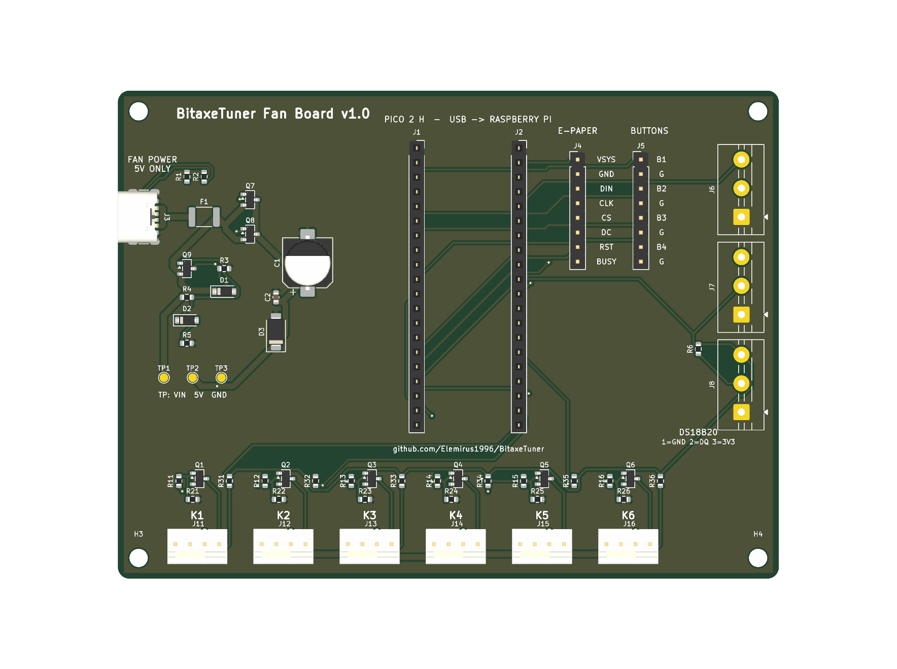

# BitaxeTuner Lüfterplatine v1.0

Fertig bestückbare Platine für die Pico-Lüftersteuerung von BitaxeTuner – derselbe Aufbau wie auf dem Steckbrett
(Anleitung „Pico-Lüftersteuerung“), nur ohne Löten: bei JLCPCB bestellen, Raspberry Pi Pico 2 H aufstecken, fertig.

## Was drauf ist

| Bereich | Inhalt |
|---|---|
| Pico 2 H | steckbar auf zwei Buchsenleisten 1×20 (tauschbar), USB des Pico zum oberen Rand → Raspberry Pi |
| Lüfter K1–K6 | 4-Pin-PWM-Lüfter **5 V** (Molex 47053, mit Nase), je Kanal BC847B + 1 kΩ + 10 kΩ (Ausfallschutz) + 10 kΩ Tacho-Pull-up auf 3,3 V |
| Lüfterstrom | USB-C nur als Stromeingang (5 V von einem USB-Ladegerät, mind. 2 A), Sicherung 2 A, Überspannungsabschaltung ab ca. 6,2 V, TVS-Diode, Elko 470 µF |
| E-Paper | Stiftleiste 1×8: VSYS, GND, DIN, CLK, CS, DC, RST, BUSY (Kabel zum Waveshare 7,5" B) |
| Taster | Stiftleiste 1×8: je Taster Signal + GND nebeneinander (B1 G B2 G B3 G B4 G) |
| Temperaturfühler | 3 Schraubklemmen für DS18B20 (1 = GND, 2 = DQ, 3 = 3,3 V), ein 4,7 kΩ für alle |
| Messpunkte | TP1 Eingang, TP2 +5 V Lüfter, TP3 GND – für die Prüfung mit Labornetzteil |

Größe 115 × 85 mm, 2 Lagen, 4 Befestigungslöcher M3, Massefläche auf beiden Seiten.

Pinbelegung = Firmware `btfan.py` (v6): PWM GP0/2/4/6/8/10, Tacho GP16–21, Taster GP1/3/5/7, DS18B20 GP26,
E-Paper GP11–15 und GP22. Das Skript `skripte/verify.py` prüft die Platine automatisch dagegen.

## Sicherheit (bewusst so gebaut)

- **Ausfallschutz:** Ohne Signal vom Pico (aus, abgestürzt, Kabel ab) sperrt der Transistor über R2 (10 kΩ nach GND)
  und der Lüfter läuft mit voller Drehzahl.
- **Keine 5 V an Pico-Pins:** PWM des Lüfters hängt nur am Transistor, Tacho nur über 10 kΩ an 3,3 V.
- **Lüfterstrom getrennt vom Pico:** Die 5 V vom USB-C gehen nur an die Lüfter, nie an VBUS/VSYS des Pico – sonst
  würde das Ladegerät über den Pico in den Raspberry Pi zurückspeisen. Nur die Masse ist gemeinsam.
- **Falsches Netzteil:** Ab ca. 6,2 V (Streuung 5,8–6,5 V) schalten die zwei MOSFETs ab; ein versehentliches
  12-V-Netzteil erreicht die 5-V-Lüfter nicht. Die Gate-Spannung der MOSFETs ist durch eine 6,2-V-Diode begrenzt.

## Bestellen bei JLCPCB

1. **Gerber hochladen:** `fertigung/bitaxetuner-fan-board-gerber.zip`. Einstellungen: 2 Lagen, 1,6 mm, Farbe nach Wunsch,
   „Remove Order Number“ nach Wunsch. Menge 5 (Mindestmenge).
2. **„PCB Assembly“ einschalten:** Bestückung oben (Top Side), Menge z. B. 2. Wegen der Durchsteckteile (Buchsenleisten,
   Lüfterstecker, Klemmen, USB-C) ist meist **Standard**-Bestückung nötig.
3. **BOM und CPL hochladen:** `fertigung/BOM_JLCPCB.csv` und `fertigung/CPL_JLCPCB.csv`.
4. **Teile prüfen:** Alle 19 Positionen müssen zugeordnet sein. Besonders den Bestand der USB-C-Buchse
   **GCT USB4125-GF-A (C3151650)** prüfen – bei LCSC sind nur wenige auf Lager; falls nötig vorbestellen oder als
   Ersatz eine andere 6-polige USB-C-Buchse **mit durchgesteckten Gehäuselaschen** wählen (Bauform prüfen!).
5. **Bestückungsvorschau genau ansehen** (das ist der wichtigste Schritt):
   - Elko C1: das **+** muss zum Pad mit dem „+“ im Druck zeigen.
   - Dioden D1, D2, D3: der Kathodenstrich zur markierten Seite.
   - Transistoren Q1–Q9 (SOT-23): ein Bein auf der einen, zwei auf der anderen Seite – wie im Druck.
   - USB-C J3: Öffnung zum linken Platinenrand. **Bekannt: Die Position von J3 in `CPL_JLCPCB.csv` stimmt noch nicht
     ganz** – in der Vorschau muss J3 verschoben werden, bis die Kontakte genau auf den Pads und die Laschen in den
     Löchern sitzen (Drehung −90° stimmt). Den korrigierten Wert bitte als Issue melden, dann kommt er in die Datei.
   Liegt ein Teil verdreht, im Vorschau-Editor drehen – nicht bestellen, solange etwas falsch aussieht.
   Die übrigen Drehungen und Positionen (SOT-23 +180°, Stecker auf Bauteilmitte, Leisten +90°) sind bereits in der
   Vorschau geprüft und in der Datei korrigiert.
6. Kosten (Schätzung vom 03.10.2026): etwa 60–75 € (Economic) bzw. 90–110 € (Standard) für 5 Platinen, davon 2 bestückt,
   inkl. Versand und Einfuhrumsatzsteuer.

## Nach der Lieferung prüfen – vor dem ersten Lüfter

1. **Sichtprüfung:** Lötstellen der Durchsteckteile, keine Brücken, Elko und Dioden richtig herum.
2. **Ohne Pico, ohne Lüfter, mit Labornetzteil** (Strombegrenzung 0,2 A) an **TP1 (+)** und **TP3 (−)**:
   - 5,0 V → an **TP2** ca. 5,0 V.
   - langsam auf 6,5 V erhöhen → TP2 muss auf nahezu 0 V fallen (Abschaltung). Schwelle notieren, sollte zwischen
     5,8 und 6,5 V liegen.
   - zurück auf 5,0 V → TP2 wieder ca. 5,0 V.
   - nie mehr als 15 V anlegen.
3. **USB-Ladegerät an USB-C, einen Lüfter an K1, kein Pico:** Der Lüfter muss sofort mit voller Drehzahl laufen
   (Ausfallschutz ohne Software).
4. **Pico 2 H aufstecken** (USB zum oberen Rand), per USB-Datenkabel an den Raspberry Pi: Der BitaxeTuner-Server
   spielt das Lüfterprogramm auf; unter „Lüfter & Anzeige“ erscheint „Pico verbunden … (Programm v6)“ und die Drehzahl.
5. Ausfallschutz mit Software: bei 30 % das USB-Kabel zum Pi ziehen → nach etwa 5 Sekunden 100 %.

## Dateien

| Datei | Inhalt |
|---|---|
| `bitaxetuner-fan-board.kicad_pcb` / `.kicad_pro` | Platine für KiCad 10 (öffnen, ansehen, 3D-Ansicht, DRC) |
| `fertigung/` | Gerber + Bohrdaten (Zip), Stückliste und Bestückungsliste für JLCPCB, Bestückungsplan als PDF |
| `ansicht-oben.png`, `ansicht-unten.png` | Bilder der Platine |
| `skripte/` | So entsteht die Platine: `build_board.py` (Bauteile, Netze, Platzierung), `to_dsn.py` + Freerouting 1.9 (Leiterbahnen), `finish_board.py` (Masseflächen), `verify.py` (Prüfung gegen Firmware und Sicherheitsregeln), `export_jlc.py` (BOM/CPL), `run.sh` (alles nacheinander) |

## Ehrliche Hinweise

- Die Platine wurde per Skript entworfen und automatisch verlegt; DRC in KiCad 10 ohne Fehler und ohne offene
  Verbindungen, die elektrische Prüfung gegen die Firmware bestanden. **Es gibt keinen separaten Schaltplan
  (.kicad_sch)** – die Schaltung ist in `skripte/build_board.py` (je Bauteil kommentiert) und oben beschrieben.
- Version 1.0 ist ein **Prototyp**: Die erste Bestellung vor dem Dauerbetrieb wie oben beschrieben durchmessen.
- Die Schraubklemmen sitzen am rechten Rand; in welche Richtung ihre Kabeleinführung zeigt, habe ich nicht am
  Datenblatt geprüft – bitte in KiCad (Ansicht → 3D-Betrachter) kontrollieren, bevor bestellt wird.
- Bauteilnummern und Bestände: Stand 03.10.2026 (JLCPCB/LCSC); vor der Bestellung im JLCPCB-Assistenten prüfen.
